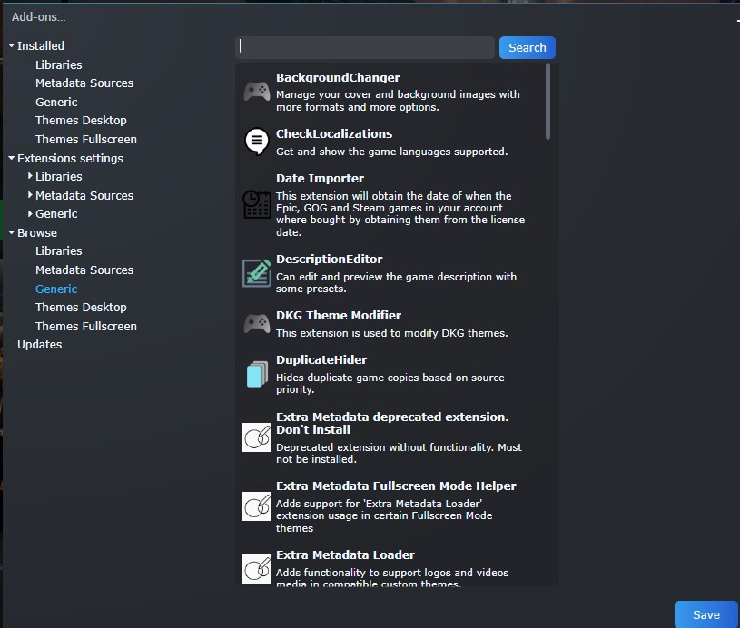
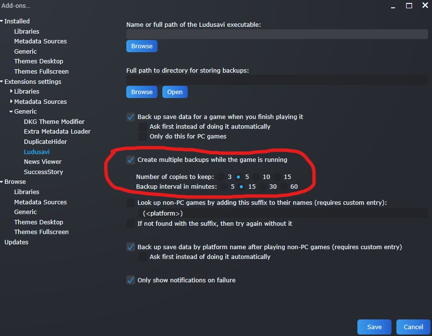
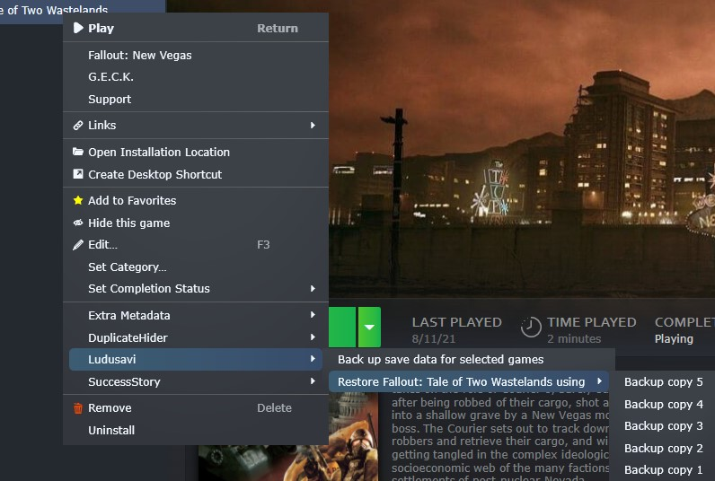

This fork is now archived - the main project now has the multiple backup feature - [ludusavi-playnite](https://github.com/mtkennerly/ludusavi-playnite)

# AutoSave
This fork of [ludusavi-playnite](https://github.com/mtkennerly/ludusavi-playnite) extends it with a few useful additions.

## Additions
- Save backups on an interval while the game is running
- Restore an individual game from a backup (the option won't be visible when multiple games are selected).
- More error notifications on common actions, instead of throwing exceptions

## Setup
The original [ludusavi-playnite](https://github.com/mtkennerly/ludusavi-playnite) plugin has some instructions to use Ludusavi.

## Installation

You can find the plugin in Playnite (version 9+):

You can also download the plugin from the [releases page](https://github.com/AIRyndon/AutoSave/releases).
Then install it on Playnite:

* Using the `*.pext` file:
  * Drag and drop the file into Playnite
* Using the `*.zip` file:
  * Extract it into a subfolder of the Playnite extensions directory
    (e.g., `C:/Users/<YOUR_NAME>/AppData/Roaming/Playnite/Extensions/Autosave`)

## Added Settings
### Add-ons Menu

### Game menu

## Notes
- the plugin has been tested on some PC games with the main backup directory in a non-protected folder
- the additional backups are stored in a directory named *Copies* relative to what is setup as the main backup directory in the extension's settings menu *(Add-ons > Extension Settings > Generic > Ludusavi)*
- this extension will be archived once the [feature](https://github.com/mtkennerly/ludusavi/issues/74) is added in Ludusavi, and [used](https://github.com/mtkennerly/ludusavi-playnite/pull/26) in the original extension
